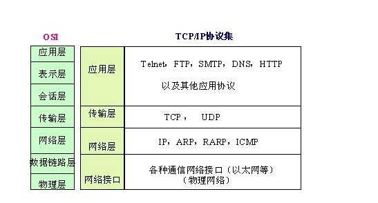

#### HTTPS
- 啥都别说先整张图

- **SSL加密层**: 把http的内容加密后送到下层的TCP，从接收方看，这一层负责将TCP送来的数据解密还原成http的内容
    - **数字证书**：一种文件的名称，好比一个机构或人的签名，能够证明这个机构或人的真实性。其中包含的信息，用于实现上述功能
    - **加密**: 将明文通过加密变成密文，如果第三方无法解密的话，就算他获得密文也无能为力
        - 对称加密：加密和解密使用相同的密钥
        - 非对称密码算法: 
            - 服务器把自己的公钥登录至数字证书认证机构
            - 证书机构把自己的私有密钥向服务器的公开密码部署数字签名并颁发公钥证书
            - 客户端拿到服务器的公钥证书后，使用数字证书认证机构的公开密钥，向数字证书认证机构验证公钥证书上的数字签名。以确认服务器公钥的真实性
            - 使用服务器的公开密钥对报文加密后发送
            - 服务器用私有密钥对报文解密
        - 散列算法：公开的算法,MD5
    - **认证**是指通信双方为了确认对方是值得信任的消息发送或接受方,相当于一个鉴定中心颁发的证书
<!--more-->
### TCP/IP
#### 三次握手
1. 参数解释
    - seq: 标识字节流
    - ack: ack=seq+1,确认序号
    - ACK：确认序号有效
    - SYN：发起一个新连接
    - FIN：释放一个连接
2. 为什么要第三次确认？
    - 因为怕出现已失效的连接请求报文段
#### 四次挥手
1. 为什么要四次挥手？
    - 当服务器收到FIN时,很可能还没传完数据,所以先说我已经收到FIN指令了,等发送完再发FIN
    
#### 什么是VPN
- vpn–虚拟专用网络，它的功能是：在公用网络上建立专用网络，进行加密通讯。你和vpn之间的通信是否加密，取决于你连接vpn的方式或者协议
#### SS-SSR-SSL-TSL
- shadowsocks(影梭): ss和ssr它的原理都是一样的，就是socks5代理,socks5代理是把你的网络数据请求通过一条连接你和代理服务器之间的通道，由服务器转发到目的地，这个过程中你是没有通过一条专用通道的，只是数据包的发出，然后被代理服务器收到
- ssr: 支持协议转换、协议混淆、多重代理。SS开源，SSR闭源
- SSL(Secure Socket Layer): SSL是VPN的一种实现方式
- TSL相当于是SSL的升级版
- [更多](https://blog.csdn.net/ShellDawn/article/details/78345240)
#### PAC-直连模式-全局模式
- PAC: 国内地址不走代理，国外走代理
- 直连模式: 流量不走代理
- 全局：全部走代理
#### 混淆
- 协议插件: 定义加密前的协议，通常用于长度混淆及增强安全性和隐蔽性
- 混淆：为了伪装，使原本的上网数据伪装成其他的数据，访问HTTPS网站的时候会用SSL证书把网站加密起来
#### Nginx正向-反向代理
- 正向代理：当我们要访问google时,用代理服务器访问,那么要访问的服务器是明确的,但是服务器不知道是哪个客户端
- 反向代理：像淘宝这种流量巨大的网站,当某台服务器负载扛不住的时候,Nginx接受到客户端的请求时,会根据一定的规则来分发给不同的服务器,此时客户端是明确的,服务器却不明确了

#### OSI

- 应用层：邮件、文件传输、HTTP超文本传输协议等,为用户的应用程序（例如电子邮件、文件传输和终端仿真）提供网络服务
- 表示层：确保一个系统的应用层所发送的信息可以被另一个系统的应用层读取
- 会话层：通过传输层（端口号：传输端口与接收端口）建立数据传输的通路，主要在你的系统之间发起会话或者接受会话请求
- 传输层：定义了一些传输数据的协议和端口号（WWW端口80等）
- 网络层：在位于不同地理位置的网络中的两个主机系统之间提供连接和路径选择
- 数据链路层：如何让格式化数据以进行传输,还有错误检查和纠正
- 物理层：定义物理设备标准，如网线的接口类型、光纤的接口类型、各种传输介质的传输速率等